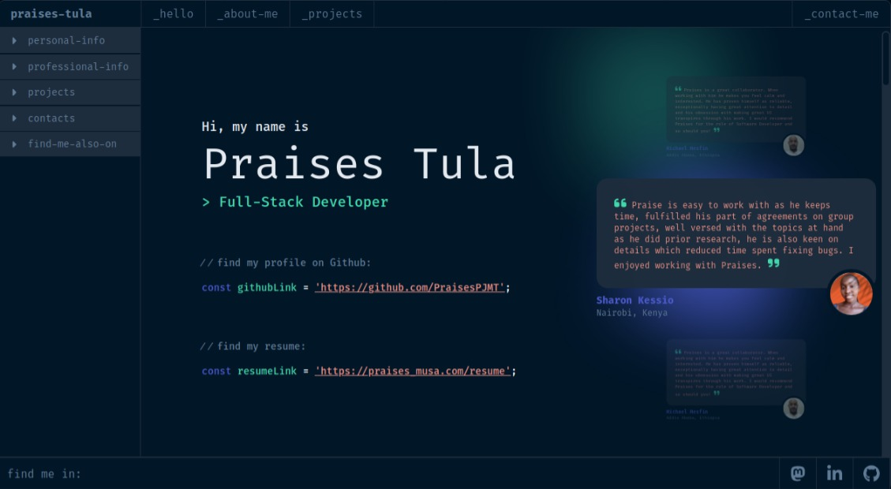

# 📗 Table of Contents

- [📗 Table of Contents](#table-of-contents)
- [📖 Praises Tula - Porfolio ](#about-project)
    - [🛠 Built With ](#built-with)
        - [Tech Stack ](#tech-stack)
        - [Key Features ](#key-features)
    - [🚀 Live Demo](#live-demo)
    - [🔭 Preview ](#preview)
    - [💻 Getting Started ](#getting-started)
        - [Prerequisites](#prerequisites)
        - [Setup](#setup)
        - [Install](#install)
        - [Usage](#usage)
    - [👥 Authors ](#authors)
    - [🤝 Contributing ](#contributing)
    - [🙏 Acknowledgements](#acknowledgements)
    - [⭐️ Show your support ](#️show-your-support)
    - [📝 License ](#license)

# 📖 Praises Tula - Portfolio <a name="about-project"></a>

> Hello!! I am Praises Tula and this is my personal portfolio.

## 🛠 Built With <a name="built-with"></a>

### Tech Stack <a name="tech-stack"></a>

> Here are the tech stacks applied in this project.
- 
- 
-  
-  
-  


<p align="right">(<a href="#readme-top">back to top</a>)</p>


### Key Features <a name="key-features"></a>
> My portfolio has the following key features:
- View details about me.
- Read my bio.
- View my tech stack and tools.
- See my portfolio of projects over the years.
- Download my resume.
- Contact me using a simple form submission.

<p align="right">(<a href="#readme-top">back to top</a>)</p>

## 🔭 Preview <a name="preview"></a>

<p align="right">(<a href="#readme-top">back to top</a>)</p>

## 🚀 Live Demo <a name="live-demo"></a>


<p align="right">(<a href="#readme-top">back to top</a>)</p>

## 💻 Getting Started <a name="getting-started"></a>

### Prerequisites

The following applications are required to be installed for the project to run!
- Modern browser e.g [Google Chrome](https://www.google.com/chrome/), [Edge](https://www.microsoft.com/en-us/edge?r=1), [Firefox](https://www.mozilla.org/en-US/exp/firefox/new/) etc.
- [Node.js](https://nodejs.org/en/download/) LTS version
- [Git](https://git-scm.com/downloads)


### Setup
Clone [this](https://github.com/PraisesPJMT/Praises-Tula.git) GitHub repository using:
```sh
    git clone https://github.com/PraisesPJMT/Praises-Tula.git
    cd Praises-Tula
```
    
### Install
Install all required modules using:
```sh
  npm install
```
### Usage
To run the project, execute the following command:
```sh
  npm start
```
- This should launch the app on the browser
- If the app is not opened immediately, then open [http://localhost:3000](http://localhost:3000) to view it in your browser.

<p align="right">(<a href="#readme-top">back to top</a>)</p>

## 👥 Authors <a name="authors"></a>
👤 **Praises Tula**

[](https://github.com/PraisesPJMT/)
[](https://www.linkedin.com/in/praises-tula/)
[](https://twitter.com/PraisesPJMT/)

[](mailto:praisesmusa@gmail.com)
[](https://angel.co/u/praises-tula/)
[](https://ruby.social/@pjmt)

## 🤝 Contributing <a name="contributing"></a>

Contributions, issues, and feature requests are welcome!

Feel free to check the [issues page](../../issues/).

<p align="right">(<a href="#readme-top">back to top</a>)</p>

## 🙏 Acknowledgments <a name="acknowledgements"></a>
- Original design idea by  [Yanka Darelova](https://www.behance.net/darelova) on Behance.
- Hat tip to you for checking out this amazing project.

<p align="right">(<a href="#readme-top">back to top</a>)</p>

## ⭐️ Show your support <a name="support"></a>

Give a ⭐️ if you like this project!
<p align="right">(<a href="#readme-top">back to top</a>)</p>

## 📝 License <a name="license"></a>

This project is [MIT](./LICENSE) licensed.

